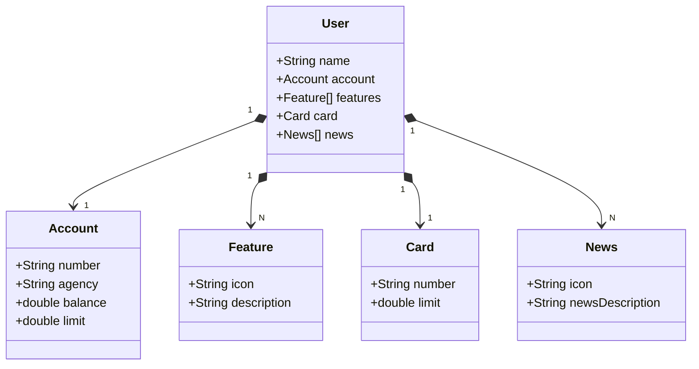

# Curso Claro Java Springboot 2024
Java RESTful API criada para o curso.

## Diagrama de Classes

```mermaid

classDiagram
    class User {
        +String name
        +Account account
        +Feature[] features
        +Card card
        +News[] news
    }

    class Account {
        +String number
        +String agency
        +double balance
        +double limit
    }

    class Feature {
        +String icon
        +String description
    }

    class Card {
        +String number
        +double limit
    }

    class News {
        +String icon
        +String newsDescription
    }

    User "1" *--> "1" Account
    User "1" *--> "N" Feature
    User "1" *--> "1" Card
    User "1" *--> "N" News
```
